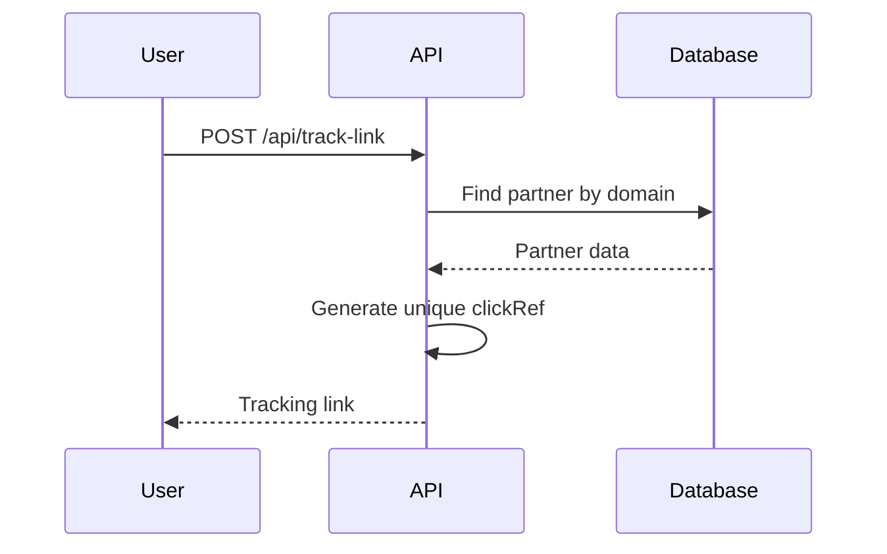
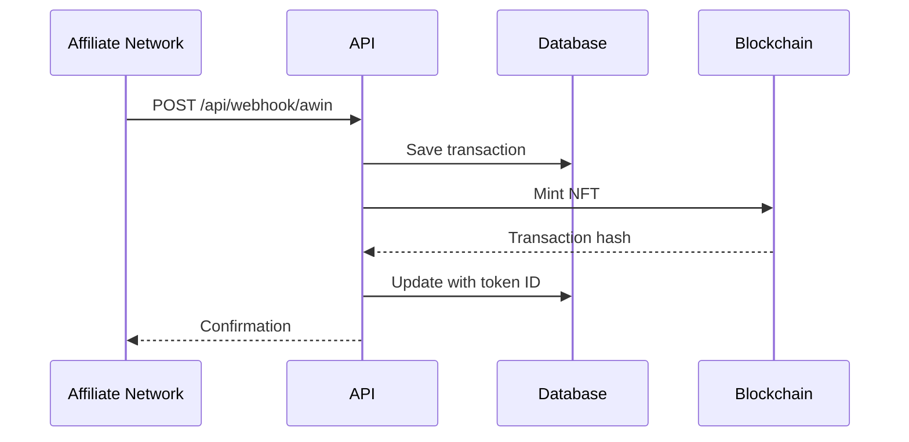

# Back2Fan API - Cashback System with NFTs

A complete API for cashback system that integrates affiliate networks (AWIN, Rakuten) with NFTs on Chiliz blockchain (Spicy Testnet), including Fan Tokens integration.

## 🚀 Features

- **Tracking Link Generation**: Converts normal URLs into trackable affiliate links
- **Affiliate Webhooks**: Automatically processes postbacks from AWIN and Rakuten
- **Cashback NFTs**: Automatically mints NFTs when cashback is confirmed
- **Fan Tokens Integration**: Support for Chiliz Fan Tokens in NFT metadata
- **Blockchain Integration**: Deployed on Spicy Testnet (Chiliz Chain)
- **RESTful API**: Complete endpoints for transaction management, NFTs and statistics

## 🏗️ Architecture

```
┌─────────────────┐    ┌─────────────────┐    ┌─────────────────┐
│   Frontend      │    │   Back2Fan API  │    │   Blockchain    │
│                 │    │                 │    │   (Spicy)       │
│ • Web App       │◄──►│ • Link Tracking │◄──►│ • NFT Contract  │
│                 │    │ • Webhooks      │    │ • Fan Tokens    │
│                 │    │ • NFT Minting   │    │                 │
└─────────────────┘    └─────────────────┘    └─────────────────┘
                              │
                              ▼
                       ┌─────────────────┐
                       │   Database      │
                       │   (Supabase)    │
                       │ • Transactions  │
                       │ • Partners      │
                       │ • Fan Tokens    │
                       └─────────────────┘
```

## 📋 Prerequisites

- Node.js 18+
- Supabase account
- AWIN Publisher account
- Rakuten Advertiser account
- Thirdweb account
- Wallet with CHZ for deployment (Spicy Testnet)

## 🛠️ Installation

1. **Clone the repository**
```bash
git clone <repository-url>
cd back2fan-api
```

2. **Install dependencies**
```bash
npm install
```

3. **Configure environment variables**
```bash
cp .env.example .env
```

Edit the `.env` file with your credentials:
```env
# Supabase Configuration
SUPABASE_URL=your_supabase_url
SUPABASE_ANON_KEY=your_supabase_anon_key

# AWIN Configuration
AWIN_PUBLISHER_ID=your_awin_publisher_id
AWIN_API_TOKEN=your_awin_api_token

# Rakuten Configuration
RAKUTEN_PUBLISHER_ID=your_rakuten_publisher_id
RAKUTEN_API_KEY=your_rakuten_api_key

# Thirdweb Configuration
THIRDWEB_CLIENT_ID=your_thirdweb_client_id
THIRDWEB_SECRET_KEY=your_thirdweb_secret_key
THIRDWEB_PRIVATE_KEY=your_wallet_private_key
NFT_CONTRACT_ADDRESS=your_nft_contract_address

# Server Configuration
PORT=5000
```

4. **Start the server**
```bash
npm start
```

The API will be available at `http://localhost:5000`

## 📚 API Documentation

### Base URL
```
https://api.back2.fan
```

### Rate Limiting
- **Limit**: 200 requests per IP every 10 minutes
- **Response headers**:
  - `X-RateLimit-Limit`: Maximum limit
  - `X-RateLimit-Remaining`: Remaining requests
  - `X-RateLimit-Reset`: Reset timestamp

---

## 🔗 Main Endpoints

### 1. Health Check
**GET** `/api/health`

Checks if the API is working.

```bash
curl -X GET "https://api.back2.fan/api/health"
```

**Response:**
```json
{
  "status": "OK",
  "timestamp": "2024-01-20T15:30:00.000Z",
  "version": "1.0.0"
}
```

---

### 2. Generate Tracking Link
**POST** `/api/track-link`

Converts a normal URL into a trackable affiliate link.

**Body:**
```json
{
  "url": "https://www.amazon.com/product",
  "userId": "550e8400-e29b-41d4-a716-446655440000",
  "network": "awin",
  "tokenId": "ebcd5d2a-bece-45c9-b1d0-f518ad5e4d17"
}
```

**Parameters:**
- `url` (string): Original product URL
- `userId` (string): Unique user ID
- `network` (string): Affiliate network (`awin` or `rakuten`)
- `tokenId` (string, optional): Fan Token ID

**Response:**
```json
{
  "success": true,
  "trackingUrl": "https://www.awin1.com/cread.php?awinmid=12345&awinaffid=67890&clickref=user_550e8400...",
  "originalUrl": "https://www.amazon.com/product",
  "userId": "550e8400-e29b-41d4-a716-446655440000",
  "network": "awin",
  "partner": {
    "id": "123e4567-e89b-12d3-a456-426614174000",
    "name": "Amazon",
    "logo": "https://example.com/amazon-logo.png"
  }
}
```

**Example:**
```bash
curl -X POST "https://api.back2.fan/api/track-link" \
  -H "Content-Type: application/json" \
  -d '{
    "url": "https://www.amazon.com/Echo-Dot-5th-generation-Alexa/dp/B09B8V1LZ3",
    "userId": "550e8400-e29b-41d4-a716-446655440000",
    "network": "awin"
  }'
```

---

### 3. Affiliate Webhooks

#### AWIN Webhook
**POST** `/api/webhook/awin`

Processes AWIN postbacks when a purchase is made.

**Body:**
```json
{
  "advertiserId": "12345",
  "clickRef": "user_550e8400-e29b-41d4-a716-446655440000_1642678200000",
  "commissionAmount": 25.50,
  "saleAmount": 510.00,
  "currency": "USD",
  "transactionId": "AWIN_TXN_123456789",
  "orderRef": "ORDER_AMZ_123456",
  "status": "confirmed"
}
```

#### Rakuten Webhook
**POST** `/api/webhook/rakuten`

Processes Rakuten postbacks.

**Body:**
```json
{
  "mid": "53459",
  "u1": "user_550e8400-e29b-41d4-a716-446655440000_1642678200000",
  "amt": 850.00,
  "cur": "USD",
  "oid": "ORDER_MAGALU_789123",
  "commission": 42.50,
  "sid": "SID_RAK_789456",
  "etd": "2024-01-20T15:30:00.000Z"
}
```

---

### 4. Get User Transactions
**GET** `/api/transactions/:userId`

Returns all transactions for a user.

**Query Parameters:**
- `status` (string, optional): Filter by status (`pending`, `confirmed`, `rejected`)
- `network` (string, optional): Filter by network (`awin`, `rakuten`)
- `limit` (number, optional): Maximum number of results (default: 50)
- `offset` (number, optional): Skip results (default: 0)

**Response:**
```json
{
  "transactions": [
    {
      "id": "123e4567-e89b-12d3-a456-426614174000",
      "user_id": "550e8400-e29b-41d4-a716-446655440000",
      "wallet_address": "0x1234567890abcdef",
      "partner_id": "456e7890-e12b-34d5-a678-901234567890",
      "transaction_id": "TXN123456789",
      "sale_amount": 310.00,
      "cashback_amount": 15.50,
      "currency": "USD",
      "affiliate_network": "awin",
      "status": "confirmed",
      "transaction_date": "2024-01-20T10:30:00.000Z",
      "partner_name": "Amazon",
      "partner_logo": "https://example.com/amazon-logo.png",
      "nft_token_id": "5",
      "nft_mint_status": "minted"
    }
  ]
}
```

**Example:**
```bash
# All transactions
curl -X GET "https://api.back2.fan/api/transactions/550e8400-e29b-41d4-a716-446655440000"

# Only confirmed
curl -X GET "https://api.back2.fan/api/transactions/550e8400-e29b-41d4-a716-446655440000?status=confirmed"

# With pagination
curl -X GET "https://api.back2.fan/api/transactions/550e8400-e29b-41d4-a716-446655440000?limit=10&offset=0"
```

---

### 5. User Statistics
**GET** `/api/stats/:userId`

Returns consolidated user statistics.

**Response:**
```json
{
  "user_id": "550e8400-e29b-41d4-a716-446655440000",
  "total_purchases": 15,
  "total_spent": 2750.00,
  "total_cashback": 137.50,
  "pending_cashback": 25.30,
  "confirmed_cashback": 112.20,
  "total_nfts": 8,
  "networks": {
    "awin": {
      "purchases": 10,
      "cashback": 89.50
    },
    "rakuten": {
      "purchases": 5,
      "cashback": 48.00
    }
  },
  "currency": "USD"
}
```

**Example:**
```bash
curl -X GET "https://api.back2.fan/api/stats/550e8400-e29b-41d4-a716-446655440000"
```

---

### 6. User NFTs
**GET** `/api/nfts/:userId`

Returns all NFTs for a user (combining blockchain + database).

**Response:**
```json
{
  "user_id": "550e8400-e29b-41d4-a716-446655440000",
  "summary": {
    "totalNFTs": 5,
    "totalCashback": 275.50,
    "confirmed": 3,
    "pending": 2
  },
  "nfts": [
    {
      "tokenId": "1",
      "owner": "0x1234567890abcdef",
      "tokenURI": "ipfs://QmHash123/1",
      "metadata": {
        "name": "Cashback NFT - Amazon",
        "description": "Cashback reward of $15.50",
        "image": "ipfs://QmImageHash/1",
        "attributes": [
          {
            "trait_type": "Partner",
            "value": "Amazon"
          },
          {
            "trait_type": "Cashback Amount",
            "value": "15.50 USD"
          }
        ]
      },
      "blockchain": {
        "network": "Spicy Testnet (Chiliz)",
        "chainId": 88882,
        "contractAddress": "0xE7350d20845FDaa6Ec54a60bad677e27c22bc8B3",
        "tokenStandard": "ERC721"
      },
      "transaction": {
        "id": "123e4567-e89b-12d3-a456-426614174000",
        "sale_amount": 310.00,
        "cashback_amount": 15.50,
        "partner_name": "Amazon",
        "status": "confirmed"
      }
    }
  ]
}
```

**Example:**
```bash
curl -X GET "https://api.back2.fan/api/nfts/550e8400-e29b-41d4-a716-446655440000"
```

---

### 7. Specific NFT Details
**GET** `/api/nft/:tokenId`

Returns complete details of a specific NFT.

**Response:**
```json
{
  "tokenId": "1",
  "owner": "0x1234567890abcdef",
  "tokenURI": "ipfs://QmHash123/1",
  "metadata": {
    "name": "Cashback NFT - Amazon",
    "description": "Cashback reward of $15.50 from Amazon",
    "image": "ipfs://QmImageHash/1",
    "attributes": [...]
  },
  "blockchain": {
    "network": "Spicy Testnet (Chiliz)",
    "chainId": 88882,
    "contractAddress": "0xE7350d20845FDaa6Ec54a60bad677e27c22bc8B3",
    "tokenStandard": "ERC721"
  },
  "transaction": {
    "id": "123e4567-e89b-12d3-a456-426614174000",
    "user_id": "550e8400-e29b-41d4-a716-446655440000",
    "sale_amount": 310.00,
    "cashback_amount": 15.50,
    "partner_name": "Amazon",
    "status": "confirmed",
    "transaction_date": "2024-01-20T10:30:00.000Z"
  }
}
```

**Example:**
```bash
curl -X GET "https://api.back2.fan/api/nft/1"
```

---

## 🔧 Administrative Endpoints

### 8. Confirm Cashback
**POST** `/api/admin/confirm-cashback/:transactionId`

Manually confirms or rejects a cashback transaction.

**Body:**
```json
{
  "status": "confirmed",
  "notes": "Cashback approved after manual verification"
}
```

**Example:**
```bash
curl -X POST "https://api.back2.fan/api/admin/confirm-cashback/123e4567-e89b-12d3-a456-426614174000" \
  -H "Content-Type: application/json" \
  -d '{
    "status": "confirmed",
    "notes": "Cashback approved"
  }'
```

### 9. Update NFT Status
**POST** `/api/admin/nft/:tokenId/status`

Updates the status of a specific NFT.

**Body:**
```json
{
  "status": "confirmed",
  "notes": "NFT confirmed and ready for claim"
}
```

**Example:**
```bash
curl -X POST "https://api.back2.fan/api/admin/nft/1/status" \
  -H "Content-Type: application/json" \
  -d '{
    "status": "confirmed",
    "notes": "NFT confirmed"
  }'
```

### 10. Configure Claim Conditions
**POST** `/api/admin/configure-claim-conditions`

Configures claim conditions for NFTs.

**Body:**
```json
{
  "price": "0",
  "maxClaimableSupply": "1000",
  "maxClaimablePerWallet": "10"
}
```

---

## 🛠️ Blockchain Endpoints

### 11. Check Account Roles
**GET** `/api/contract/my-roles`

Checks which roles the current account has in the contract.

**Response:**
```json
{
  "success": true,
  "address": "0x1234567890abcdef",
  "roles": {
    "hasDefaultAdminRole": true,
    "hasMinterRole": true
  }
}
```

### 12. Check Specific Role
**GET** `/api/contract/has-role/:roleHash/:address`

Checks if an address has a specific role.

**Example:**
```bash
# Check MINTER_ROLE
curl -X GET "https://api.back2.fan/api/contract/has-role/0x9f2df0fed2c77648de5860a4cc508cd0818c85b8b8a1ab4ceeef8d981c8956a6/0x1234567890abcdef"
```

### 13. Wallet NFTs
**GET** `/api/contract/wallet/:walletAddress/nfts`

Fetches NFTs directly from blockchain contract for a specific wallet.

**Response:**
```json
{
  "wallet": "0x1234567890abcdef",
  "summary": {
    "totalNFTs": 3,
    "totalCashback": 185.30,
    "confirmed": 2,
    "pending": 1
  },
  "nfts": [...]
}
```

---

## 📊 Status Codes

| Code | Description |
|------|-------------|
| 200 | Success |
| 201 | Created successfully |
| 400 | Bad request |
| 401 | Unauthorized |
| 404 | Not found |
| 429 | Too many requests (rate limit) |
| 500 | Internal server error |

---

## 🔄 Complete Flow

### 1. Link Generation


### 2. Purchase Processing


---

## 🚨 Error Handling

All endpoints return errors in JSON format:

```json
{
  "error": "Error description",
  "code": "ERROR_CODE",
  "details": "Additional information"
}
```

### Common Error Codes:
- `INVALID_URL`: Provided URL is invalid
- `PARTNER_NOT_FOUND`: Partner not found for domain
- `USER_NOT_FOUND`: User not found
- `TRANSACTION_NOT_FOUND`: Transaction not found
- `RATE_LIMIT_EXCEEDED`: Request limit exceeded
- `BLOCKCHAIN_ERROR`: Blockchain interaction error

---

## 🔧 Advanced Configuration

### Fan Tokens
The API supports integration with Chiliz Fan Tokens. To include a Fan Token in NFT metadata:

```bash
curl -X POST "https://api.back2.fan/api/track-link" \
  -H "Content-Type: application/json" \
  -d '{
    "url": "https://www.example.com/product",
    "userId": "user123",
    "network": "awin",
    "tokenId": "fan-token-uuid"
  }'
```

### Custom Webhooks
Configure custom webhook URLs in affiliate networks:

**AWIN:**
- URL: `https://api.back2.fan/api/webhook/awin`
- Method: POST
- Format: JSON

**Rakuten:**
- URL: `https://api.back2.fan/api/webhook/rakuten`
- Method: POST
- Format: JSON

---

## 📈 Monitoring

### Logs
The API generates detailed logs for:
- Webhook processing
- NFT minting
- Blockchain errors
- Rate limiting

### Available Metrics
- Total links generated
- Conversion rate
- Cashback volume
- NFTs minted
- Errors per endpoint

---

## 🛡️ Security

### Rate Limiting
- 200 requests per IP every 10 minutes
- Rate limit headers included in responses

### Validation
- Strict input data validation
- URL sanitization
- Webhook signature verification

### Blockchain Security
- Role-based access control in NFT contract
- Ownership verification before operations
- Secure private key transaction signing

---


