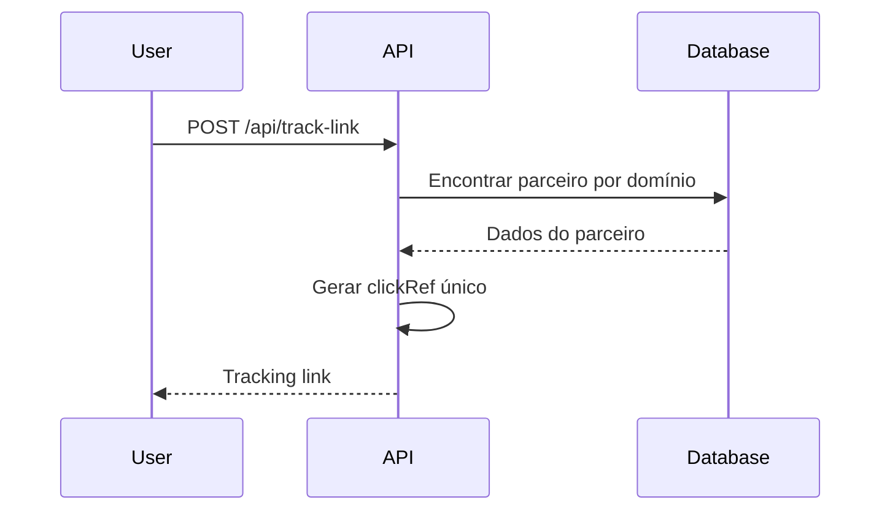
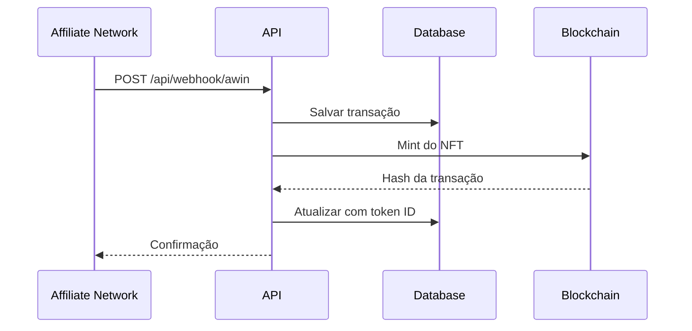

# Back2Fan API - Sistema de Cashback com NFTs

Uma API completa para sistema de cashback que integra redes de afiliados (AWIN, Rakuten) com NFTs na blockchain da Chiliz (Spicy Testnet), incluindo integração com Fan Tokens.

## 🚀 Funcionalidades

- **Geração de Links de Rastreamento**: Converte URLs normais em links de afiliado rastreáveis
- **Webhooks de Afiliados**: Processa automaticamente postbacks da AWIN e Rakuten
- **Cashback em NFTs**: Faz o mint automático de NFTs quando o cashback é confirmado
- **Integração com Fan Tokens**: Suporte a Fan Tokens da Chiliz no metadata do NFT
- **Integração Blockchain**: Deploy na Spicy Testnet (Chiliz Chain)
- **API RESTful**: Endpoints completos para transações, NFTs e estatísticas

## 🏗️ Arquitetura

```
┌─────────────────┐    ┌─────────────────┐    ┌─────────────────┐
│   Frontend      │    │   Back2Fan API  │    │   Blockchain    │
│                 │    │                 │    │   (Spicy)       │
│ • Web App       │◄──►│ • Link Tracking │◄──►│ • Contrato NFT  │
│                 │    │ • Webhooks      │    │ • Fan Tokens    │
│                 │    │ • Mint de NFT   │    │                 │
└─────────────────┘    └─────────────────┘    └─────────────────┘
                              │
                              ▼
                       ┌─────────────────┐
                       │   Database      │
                       │   (Supabase)    │
                       │ • Transações    │
                       │ • Parceiros     │
                       │ • Fan Tokens    │
                       └─────────────────┘
```

## 📋 Pré-requisitos

- Node.js 18+
- Conta no Supabase
- Conta de Publisher na AWIN
- Conta de Advertiser na Rakuten
- Conta no Thirdweb
- Carteira com CHZ para deploy (Spicy Testnet)

## 🛠️ Instalação

1. **Clonar o repositório**
```bash
git clone <repository-url>
cd back2fan-api
```

2. **Instalar dependências**
```bash
npm install
```

3. **Configurar variáveis de ambiente**
```bash
cp .env.example .env
```

Edite o arquivo `.env` com suas credenciais:
```env
# Supabase
SUPABASE_URL=sua_url_supabase
SUPABASE_ANON_KEY=sua_chave_supabase

# AWIN
AWIN_PUBLISHER_ID=seu_awin_publisher_id
AWIN_API_TOKEN=seu_awin_api_token

# Rakuten
RAKUTEN_PUBLISHER_ID=seu_rakuten_publisher_id
RAKUTEN_API_KEY=seu_rakuten_api_key

# Thirdweb
THIRDWEB_CLIENT_ID=seu_thirdweb_client_id
THIRDWEB_SECRET_KEY=seu_thirdweb_secret_key
THIRDWEB_PRIVATE_KEY=sua_private_key_da_wallet
NFT_CONTRACT_ADDRESS=seu_endereco_do_contrato_nft

# Servidor
PORT=5000
```

4. **Iniciar o servidor**
```bash
npm start
```

A API ficará disponível em `http://localhost:5000`

## 📚 Documentação da API

### URL Base
```
https://api.back2.fan
```

### Rate Limiting
- **Limite**: 200 requisições por IP a cada 10 minutos
- **Headers de resposta**:
  - `X-RateLimit-Limit`: Limite máximo
  - `X-RateLimit-Remaining`: Restante
  - `X-RateLimit-Reset`: Timestamp de reset

---

## 🔗 Endpoints Principais

### 1. Health Check
**GET** `/api/health`

Verifica se a API está funcionando.

```bash
curl -X GET "https://api.back2.fan/api/health"
```

**Resposta:**
```json
{
  "status": "OK",
  "timestamp": "2024-01-20T15:30:00.000Z",
  "version": "1.0.0"
}
```

---

### 2. Gerar Link de Rastreamento
**POST** `/api/track-link`

Converte uma URL normal em um link de afiliado rastreável.

**Body:**
```json
{
  "url": "https://www.amazon.com/product",
  "userId": "550e8400-e29b-41d4-a716-446655440000",
  "network": "awin",
  "tokenId": "ebcd5d2a-bece-45c9-b1d0-f518ad5e4d17"
}
```

**Parâmetros:**
- `url` (string): URL original do produto
- `userId` (string): ID único do usuário
- `network` (string): Rede de afiliados (`awin` ou `rakuten`)
- `tokenId` (string, opcional): ID do Fan Token

**Resposta:**
```json
{
  "success": true,
  "trackingUrl": "https://www.awin1.com/cread.php?awinmid=12345&awinaffid=67890&clickref=user_550e8400...",
  "originalUrl": "https://www.amazon.com/product",
  "userId": "550e8400-e29b-41d4-a716-446655440000",
  "network": "awin",
  "partner": {
    "id": "123e4567-e89b-12d3-a456-426614174000",
    "name": "Amazon",
    "logo": "https://example.com/amazon-logo.png"
  }
}
```

**Exemplo:**
```bash
curl -X POST "https://api.back2.fan/api/track-link"   -H "Content-Type: application/json"   -d '{
    "url": "https://www.amazon.com/Echo-Dot-5th-generation-Alexa/dp/B09B8V1LZ3",
    "userId": "550e8400-e29b-41d4-a716-446655440000",
    "network": "awin"
  }'
```

---

### 3. Webhooks de Afiliados

#### Webhook AWIN
**POST** `/api/webhook/awin`

Processa postbacks da AWIN quando uma compra é realizada.

**Body:**
```json
{
  "advertiserId": "12345",
  "clickRef": "user_550e8400-e29b-41d4-a716-446655440000_1642678200000",
  "commissionAmount": 25.50,
  "saleAmount": 510.00,
  "currency": "USD",
  "transactionId": "AWIN_TXN_123456789",
  "orderRef": "ORDER_AMZ_123456",
  "status": "confirmed"
}
```

#### Webhook Rakuten
**POST** `/api/webhook/rakuten`

Processa postbacks da Rakuten.

**Body:**
```json
{
  "mid": "53459",
  "u1": "user_550e8400-e29b-41d4-a716-446655440000_1642678200000",
  "amt": 850.00,
  "cur": "USD",
  "oid": "ORDER_MAGALU_789123",
  "commission": 42.50,
  "sid": "SID_RAK_789456",
  "etd": "2024-01-20T15:30:00.000Z"
}
```

---

### 4. Transações do Usuário
**GET** `/api/transactions/:userId`

Retorna todas as transações de um usuário.

**Query Params:**
- `status` (string, opcional): Filtrar por status (`pending`, `confirmed`, `rejected`)
- `network` (string, opcional): Filtrar por rede (`awin`, `rakuten`)
- `limit` (number, opcional): Máximo de resultados (default: 50)
- `offset` (number, opcional): Pular resultados (default: 0)

**Resposta:**
```json
{
  "transactions": [
    {
      "id": "123e4567-e89b-12d3-a456-426614174000",
      "user_id": "550e8400-e29b-41d4-a716-446655440000",
      "wallet_address": "0x1234567890abcdef",
      "partner_id": "456e7890-e12b-34d5-a678-901234567890",
      "transaction_id": "TXN123456789",
      "sale_amount": 310.00,
      "cashback_amount": 15.50,
      "currency": "USD",
      "affiliate_network": "awin",
      "status": "confirmed",
      "transaction_date": "2024-01-20T10:30:00.000Z",
      "partner_name": "Amazon",
      "partner_logo": "https://example.com/amazon-logo.png",
      "nft_token_id": "5",
      "nft_mint_status": "minted"
    }
  ]
}
```

**Exemplos:**
```bash
# Todas as transações
curl -X GET "https://api.back2.fan/api/transactions/550e8400-e29b-41d4-a716-446655440000"

# Somente confirmadas
curl -X GET "https://api.back2.fan/api/transactions/550e8400-e29b-41d4-a716-446655440000?status=confirmed"

# Com paginação
curl -X GET "https://api.back2.fan/api/transactions/550e8400-e29b-41d4-a716-446655440000?limit=10&offset=0"
```

---

### 5. Estatísticas do Usuário
**GET** `/api/stats/:userId`

Retorna estatísticas consolidadas do usuário.

**Resposta:**
```json
{
  "user_id": "550e8400-e29b-41d4-a716-446655440000",
  "total_purchases": 15,
  "total_spent": 2750.00,
  "total_cashback": 137.50,
  "pending_cashback": 25.30,
  "confirmed_cashback": 112.20,
  "total_nfts": 8,
  "networks": {
    "awin": {
      "purchases": 10,
      "cashback": 89.50
    },
    "rakuten": {
      "purchases": 5,
      "cashback": 48.00
    }
  },
  "currency": "USD"
}
```

**Exemplo:**
```bash
curl -X GET "https://api.back2.fan/api/stats/550e8400-e29b-41d4-a716-446655440000"
```

---

### 6. NFTs do Usuário
**GET** `/api/nfts/:userId`

Retorna todos os NFTs de um usuário (combinando blockchain + banco).

**Resposta:**
```json
{
  "user_id": "550e8400-e29b-41d4-a716-446655440000",
  "summary": {
    "totalNFTs": 5,
    "totalCashback": 275.50,
    "confirmed": 3,
    "pending": 2
  },
  "nfts": [
    {
      "tokenId": "1",
      "owner": "0x1234567890abcdef",
      "tokenURI": "ipfs://QmHash123/1",
      "metadata": {
        "name": "Cashback NFT - Amazon",
        "description": "Cashback reward of $15.50",
        "image": "ipfs://QmImageHash/1",
        "attributes": [
          { "trait_type": "Partner", "value": "Amazon" },
          { "trait_type": "Cashback Amount", "value": "15.50 USD" }
        ]
      },
      "blockchain": {
        "network": "Spicy Testnet (Chiliz)",
        "chainId": 88882,
        "contractAddress": "0xE7350d20845FDaa6Ec54a60bad677e27c22bc8B3",
        "tokenStandard": "ERC721"
      },
      "transaction": {
        "id": "123e4567-e89b-12d3-a456-426614174000",
        "sale_amount": 310.00,
        "cashback_amount": 15.50,
        "partner_name": "Amazon",
        "status": "confirmed"
      }
    }
  ]
}
```

**Exemplo:**
```bash
curl -X GET "https://api.back2.fan/api/nfts/550e8400-e29b-41d4-a716-446655440000"
```

---

### 7. Detalhes de um NFT
**GET** `/api/nft/:tokenId`

Retorna os detalhes completos de um NFT específico.

**Resposta:**
```json
{
  "tokenId": "1",
  "owner": "0x1234567890abcdef",
  "tokenURI": "ipfs://QmHash123/1",
  "metadata": {
    "name": "Cashback NFT - Amazon",
    "description": "Cashback reward of $15.50 from Amazon",
    "image": "ipfs://QmImageHash/1",
    "attributes": []
  },
  "blockchain": {
    "network": "Spicy Testnet (Chiliz)",
    "chainId": 88882,
    "contractAddress": "0xE7350d20845FDaa6Ec54a60bad677e27c22bc8B3",
    "tokenStandard": "ERC721"
  },
  "transaction": {
    "id": "123e4567-e89b-12d3-a456-426614174000",
    "user_id": "550e8400-e29b-41d4-a716-446655440000",
    "sale_amount": 310.00,
    "cashback_amount": 15.50,
    "partner_name": "Amazon",
    "status": "confirmed",
    "transaction_date": "2024-01-20T10:30:00.000Z"
  }
}
```

**Exemplo:**
```bash
curl -X GET "https://api.back2.fan/api/nft/1"
```

---

## 🔧 Endpoints Administrativos

### 8. Confirmar Cashback
**POST** `/api/admin/confirm-cashback/:transactionId`

Confirma ou rejeita manualmente uma transação.

**Body:**
```json
{
  "status": "confirmed",
  "notes": "Cashback aprovado após verificação manual"
}
```

**Exemplo:**
```bash
curl -X POST "https://api.back2.fan/api/admin/confirm-cashback/123e4567-e89b-12d3-a456-426614174000"   -H "Content-Type: application/json"   -d '{ "status": "confirmed", "notes": "Cashback aprovado" }'
```

### 9. Atualizar Status do NFT
**POST** `/api/admin/nft/:tokenId/status`

Atualiza o status de um NFT específico.

**Body:**
```json
{
  "status": "confirmed",
  "notes": "NFT confirmado e pronto para claim"
}
```

**Exemplo:**
```bash
curl -X POST "https://api.back2.fan/api/admin/nft/1/status"   -H "Content-Type: application/json"   -d '{ "status": "confirmed", "notes": "NFT confirmado" }'
```

### 10. Configurar Condições de Claim
**POST** `/api/admin/configure-claim-conditions`

Configura condições de claim para NFTs.

**Body:**
```json
{
  "price": "0",
  "maxClaimableSupply": "1000",
  "maxClaimablePerWallet": "10"
}
```

---

## 🛠️ Endpoints de Blockchain

### 11. Minhas Roles na Conta
**GET** `/api/contract/my-roles`

Verifica quais roles a conta atual possui no contrato.

**Resposta:**
```json
{
  "success": true,
  "address": "0x1234567890abcdef",
  "roles": {
    "hasDefaultAdminRole": true,
    "hasMinterRole": true
  }
}
```

### 12. Verificar Role Específica
**GET** `/api/contract/has-role/:roleHash/:address`

Verifica se um endereço possui uma role específica.

**Exemplo:**
```bash
# Verificar MINTER_ROLE
curl -X GET "https://api.back2.fan/api/contract/has-role/0x9f2df0fed2c77648de5860a4cc508cd0818c85b8b8a1ab4ceeef8d981c8956a6/0x1234567890abcdef"
```

### 13. NFTs de uma Wallet
**GET** `/api/contract/wallet/:walletAddress/nfts`

Busca NFTs diretamente no contrato para uma wallet.

**Resposta:**
```json
{
  "wallet": "0x1234567890abcdef",
  "summary": {
    "totalNFTs": 3,
    "totalCashback": 185.30,
    "confirmed": 2,
    "pending": 1
  },
  "nfts": []
}
```

---

## 📊 Status Codes

| Código | Descrição |
|-------:|-----------|
| 200 | Sucesso |
| 201 | Criado com sucesso |
| 400 | Requisição inválida |
| 401 | Não autorizado |
| 404 | Não encontrado |
| 429 | Muitas requisições (rate limit) |
| 500 | Erro interno do servidor |

---

## 🔄 Fluxos Completos

### 1. Geração de Link


### 2. Processamento de Compra


---

## 🚨 Tratamento de Erros

Todos os endpoints retornam erros em JSON:

```json
{
  "error": "Descrição do erro",
  "code": "ERROR_CODE",
  "details": "Informações adicionais"
}
```

### Códigos de Erro Comuns:
- `INVALID_URL`: URL fornecida inválida
- `PARTNER_NOT_FOUND`: Parceiro não encontrado para o domínio
- `USER_NOT_FOUND`: Usuário não encontrado
- `TRANSACTION_NOT_FOUND`: Transação não encontrada
- `RATE_LIMIT_EXCEEDED`: Limite de requisições excedido
- `BLOCKCHAIN_ERROR`: Erro na interação com a blockchain

---
# 📘 DOCUMENTAÇÃO PARA INTEGRAÇÃO COM O SEU PRÓPRIO SITE

Abaixo está um guia **em português** para integrar o **seu e‑commerce** à Back2Fan.  
Você poderá usar a **API** — basta enviar um POST para o nosso endpoint com os campos mínimos exigidos, após a integração.

## 🔌 Integração direta com seu site prório (visão geral)

1. **Entre em contato** como um parceiro no nosso sistema seu endpoint será liberado.
2. **Gere o link rastreável** chamando `POST /api/track-link`.  
   - O campo `trackingUrl` da resposta contém o parâmetro `clickref=user_<userId>_<timestamp>`.
   - **Guarde o `clickref`** (você pode extrair do `trackingUrl`) na sessão do usuário, cookie ou no pedido.
3. **No pagamento aprovado**, seu backend envia **um POST** para nosso endpoint: `POST /api/webhook/awin` com JSON contendo **pelo menos**:
   - `advertiserId` (string) – Identificador da sua loja (Fornecido por nós).
   - `clickRef` (string) – O mesmo valor `user_<userId>_<timestamp>` do passo 2.
   - `saleAmount` (number) – Valor total da venda.
   - `commissionAmount` (number) – Comissão equivalente de afiliado.
   - `currency` (string ISO) – Ex.: `"USD"`, `"BRL"`.
   - `transactionId` (string) – ID único da transação no seu sistema.
   - `orderRef` (string) – Número/Referência do pedido.
   - `status` (string) – `"pending"`, `"confirmed"` ou `"rejected"`.
4. **Pronto**: nós registramos a transação, calculamos o cashback e, quando `status="confirmed"`, **confirmamos no NFT** de cashback.


## 📮 Endpoint

**URL:** `https://api.back2.fan/api/webhook/awin`  
**Método:** `POST`  
**Content‑Type:** `application/json`

### 🧾 Corpo mínimo (JSON)
```json
{
  "advertiserId": "CUSTOM",
  "clickRef": "user_550e8400-e29b-41d4-a716-446655440000_1712688000000",
  "commissionAmount": 25.50,
  "saleAmount": 510.00,
  "currency": "USD",
  "transactionId": "STORE_TXN_123456789",
  "orderRef": "ORDER_ABC_123456",
  "status": "confirmed"
}
```

---

## 🛡️ Segurança

### Rate Limiting
- 200 requisições por IP a cada 10 minutos (headers incluídos)

### Validação
- Validação de inputs estrita
- Sanitização de URLs
- Verificação de assinatura de webhook (quando disponível)

### Segurança na Blockchain
- Controle de acesso por roles no contrato NFT
- Verificação de ownership antes de operações
- Assinatura segura de transações com chave privada

---
