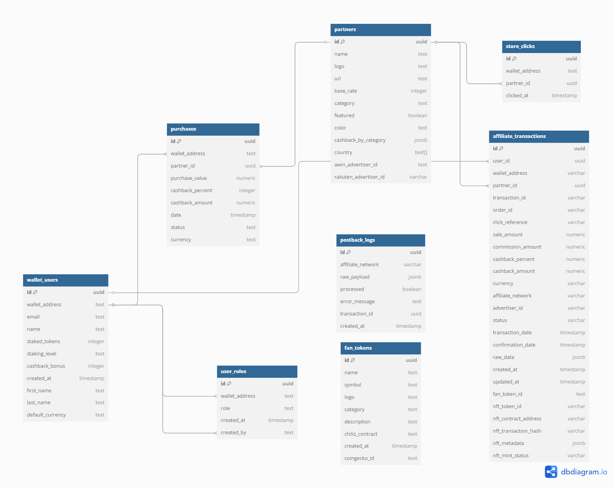

# Back2Fan Platform

Uma plataforma inovadora de **cashback** que combina compras em lojas parceiras com **Fan Tokens** e **staking** para maximizar recompensas.  
Os usuários podem ganhar cashback em suas compras e aumentar suas recompensas ao fazer staking de Fan Tokens.

## 🌟 Principais Funcionalidades

### 💰 Sistema de Cashback
- Cashback em compras realizadas em lojas parceiras  
- Taxas de cashback variáveis por categoria e loja  
- Sistema de bônus baseado em níveis de staking (em breve)  
- Suporte a múltiplas moedas (USD, EUR, BRL, GBP, etc.)

### 🏆 Sistema de Staking com Níveis (em breve)
- **Bronze** (100+ tokens): +1% de bônus em cashback  
- **Prata** (500+ tokens): +2% de bônus em cashback  
- **Ouro** (1000+ tokens): +3% de bônus em cashback  

### 🎫 Fan Tokens
- Integração com tokens de futebol e times esportivos  
- Preços em tempo real via API do CoinGecko  
- Suporte a staking para bônus de cashback (em breve)  
- Visualização de portfólio de tokens  

### 🛍️ Lojas Parceiras
- Catálogo de lojas parceiras  
- Filtros por país, categoria e taxa de cashback  
- Redirecionamento seguro para compras  
- Rastreamento de cliques e conversões  

### 🌍 Suporte Multilíngue
- Português, Inglês, Espanhol, Francês, Alemão, Italiano  
- Localização baseada em país (BR, US, ES, etc.)  
- Moedas locais automáticas  

## 🚀 Tecnologias Utilizadas

### Frontend
- **React 18** com TypeScript  
- **Vite** para desenvolvimento e build  
- **Tailwind CSS** para estilização  
- **shadcn/ui** para componentes  
- **React Router** para navegação  
- **React Query** para gerenciamento de estado  
- **i18next** para internacionalização  

### Blockchain & Web3
- **Wagmi** para interação com blockchain  
- **Reown AppKit** para conexão de carteiras  
- **Chiliz Chain** como blockchain principal  
- **Viem** para utilidades do Ethereum  

### Backend & Banco de Dados
- **Supabase** como backend e banco de dados  
- **PostgreSQL** com Row Level Security  
- **Edge Functions** para lógica serverless  
- **Assinaturas em tempo real** para atualizações instantâneas  

### APIs Externas
- **CoinGecko API** para preços de tokens  
- **Redes de Afiliados** (Awin, Rakuten) para rastreamento  

## 🗄️ Arquitetura do Banco de Dados

A plataforma usa PostgreSQL via Supabase com a seguinte estrutura de tabelas:



### Tabelas Principais

#### `wallet_users`
Armazena informações do usuário e conexões de carteira:
- `id` (uuid): Identificador único do usuário  
- `wallet_address` (text): Endereço da carteira blockchain do usuário  
- `email` (text): E-mail do usuário  
- `name` (text): Nome completo  
- `first_name` (text): Primeiro nome  
- `last_name` (text): Sobrenome  
- `staked_tokens` (integer): Quantidade de tokens em staking  
- `staking_level` (text): Nível de staking (bronze/prata/ouro)  
- `cashback_bonus` (integer): Percentual de bônus vindo do staking  
- `default_currency` (text): Moeda preferida do usuário  
- `created_at` (timestamp): Data de criação da conta  

#### `partners`
Lojas parceiras e suas configurações:
- `id` (uuid): Identificador único da loja  
- `name` (text): Nome da loja  
- `logo` (text): URL ou emoji do logo da loja  
- `url` (text): URL do site da loja  
- `base_rate` (integer): Percentual base de cashback  
- `category` (text): Categoria da loja (Moda, Eletrônicos, etc.)  
- `featured` (boolean): Se a loja aparece em destaque na home  
- `color` (text): Cor usada na UI da loja  
- `country` (text[]): Lista de países suportados  
- `cashback_by_category` (jsonb): Taxas de cashback específicas por categoria  
- `awin_advertiser_id` (text): ID da loja na rede Awin  
- `rakuten_advertiser_id` (varchar): ID da loja na rede Rakuten  

#### `purchases`
Histórico de compras e registros de cashback:
- `id` (uuid): Identificador único da compra  
- `wallet_address` (text): Endereço da carteira do comprador  
- `partner_id` (uuid): Referência à loja parceira  
- `purchase_value` (numeric): Valor total da compra  
- `cashback_percent` (integer): Percentual aplicado  
- `cashback_amount` (numeric): Valor de cashback recebido  
- `currency` (text): Moeda da transação  
- `date` (timestamp): Data da compra  
- `status` (text): Status da transação (pendente/confirmada/cancelada)  

#### `fan_tokens`
Tokens disponíveis para staking:
- `id` (uuid): Identificador único do token  
- `name` (text): Nome completo do token  
- `symbol` (text): Símbolo (ex: PSG, BAR)  
- `logo` (text): Logo do token  
- `category` (text): Categoria (Futebol, eSports, etc.)  
- `description` (text): Descrição do token  
- `chiliz_contract` (text): Endereço do contrato na Chiliz Chain  
- `coingecko_id` (text): Identificador no CoinGecko  
- `created_at` (timestamp): Data de criação do token  

### Tabelas de Rastreamento

#### `store_clicks`
Rastreia cliques dos usuários em lojas parceiras:  
- `id` (uuid): Identificador único do clique  
- `wallet_address` (text): Endereço da carteira do usuário  
- `partner_id` (uuid): Loja clicada  
- `clicked_at` (timestamp): Data/hora do clique  

#### `affiliate_transactions`
Rastreamento detalhado de transações de afiliados:  
(inclui IDs, valores de venda, comissões, cashback aplicado, rede afiliada, status, NFTs associados e dados crus do webhook)

#### `postback_logs`
Logs de webhooks das redes de afiliados:  
(inclui payload bruto, status de processamento, erros e timestamps)  

### Controle de Acesso

#### `user_roles`
Sistema de gerenciamento de papéis:  
- `id` (uuid): Identificador único do papel  
- `wallet_address` (text): Carteira do usuário  
- `role` (user_role): Papel (admin/usuário)  
- `created_at` (timestamp): Data de atribuição  
- `created_by` (text): Quem atribuiu  

## 📁 Estrutura do Projeto

src/
├── components/           # Componentes reutilizáveis
│   ├── ui/              # Componentes base shadcn/ui
│   ├── admin/           # Componentes do painel administrativo
│   └── ...              
├── pages/               # Páginas da aplicação
├── hooks/               # Hooks customizados
├── locales/             # Arquivos de tradução
├── integrations/        # Integrações externas
├── utils/               # Funções utilitárias
└── types/               # Tipagens TypeScript

## 🛠️ Configuração de Desenvolvimento

### Pré-requisitos
- Node.js 18+  
- npm ou yarn  
- Conta no Supabase  
- ID de projeto no Reown AppKit  

### Instalação

1. **Clonar o repositório**
```bash
git clone
cd
```

2. **Instalar dependências**
```bash
npm install
```

3. **Configurar variáveis de ambiente**
```bash
cp .env.example .env.local
```

Editar `.env.local`:
```env
VITE_SUPABASE_URL=sua_url_supabase
VITE_SUPABASE_ANON_KEY=sua_chave_supabase
VITE_REOWN_PROJECT_ID=seu_project_id
```

4. **Rodar servidor de desenvolvimento**
```bash
npm run dev
```

Aplicação disponível em `http://localhost:8080`

### Configuração do Banco de Dados
- Migrações no diretório `supabase/migrations/`  
- Executar em ordem cronológica  
- Recursos: **RLS, funções customizadas, triggers, assinaturas em tempo real**

## 🌐 Deploy

### Lovable (Recomendado)
- Conectar repositório do GitHub  
- Configurar variáveis no painel  
- Deploy automático a cada push  

### Vercel / Netlify
- Conectar repositório  
- Configurar variáveis  
- Deploy automático (ou arrastar pasta `dist` no Netlify)  

## 🔧 Scripts Disponíveis

npm run dev          # Servidor de desenvolvimento
npm run build        # Build de produção
npm run preview      # Pré-visualização
npm run lint         # Linter

## 🏗️ Arquitetura

### Fluxo do Cashback
1. Usuário conecta carteira Web3  
2. Navega pelas lojas parceiras  
3. Clica para visitar loja (rastreamento)  
4. Faz compra na loja  
5. Sistema recebe webhook de conversão  
6. Cashback é calculado e registrado  
7. Bônus de staking aplicado (se houver)  

### Sistema de Níveis (em breve)
- Usuários fazem staking de tokens  
- Níveis calculados automaticamente  
- Bônus aplicado em compras futuras  

### Integração Web3
- Suporte a múltiplas carteiras via Reown AppKit  
- Conexão com Chiliz Chain  
- Verificação de saldo de tokens  
- Transações de staking seguras  

## 🔐 Segurança

- **Row Level Security** no Supabase  
- **Verificação de assinaturas** em transações  
- **Rate limiting** em APIs críticas  
- **Validação de dados** no frontend e backend  
- **Sanitização de entradas** de usuários  

## 🧪 Testes

npm run test          # Rodar testes
npm run test:watch    # Testes em modo watch
npm run test:coverage # Cobertura dos testes

## 📊 Monitoramento

### Analytics
- Integração com Vercel Analytics  
- Speed Insights para performance  
- Rastreamento de conversões de afiliados  

### Logs
- Logs estruturados no Supabase  
- Logs de webhooks para debug  
- Rastreamento de erros  
